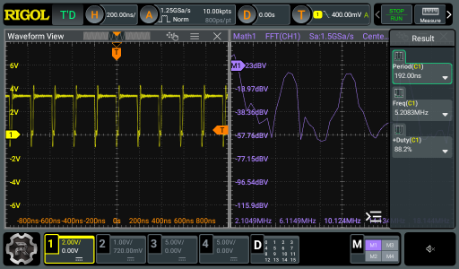

# grab-o-scope
_...a cross-platform command line tool for capturing your oscilloscope display in a .png file._

`grab-o-scope` is a Python-based command-line utility to capture screenshots from a variety of oscilloscopes and save them as PNG files, designed to run
under Windows, Linux and macOS.



_Note: At present, `grab-o-scope` supports the Rigol DHO924 and DS1054Z oscilloscopes. Other brands and models can be easily added -- see the developer notes on "Adding support for a new Oscilloscope"._

## Features

- Captures and saves screen images in PNG format
- Optionally opens the captured image in the default system viewer
- Verbose and trace modes for detailed logging and debugging
- Different makes and models of oscilloscopes can be easily supported

## Installation

### 1a. Clone this repository (using HTTPS)

```bash
git clone https://github.com/rdpoor/grab-o-scope.git
cd grab-o-scope
```

### 1b. Clone this repository (using SSH)

```bash
git clone git@github.com:rdpoor/grab-o-scope.git
cd grab-o-scope
```

### 2a. Add required modules (with pipenv)

[pipenv](https://pipenv.pypa.io/en/latest/index.html) is a cross-platform tool that creates a per-project sandbox to avoid polluting your global Python environment. Assuming you have 
`pipenv` on your system, install `grab-o-scope` as follows:

```bash
pipenv update
```

### 2b. Add required modules (without pipenv)

```bash
pip install pyvisa
pip install pyvisa_py
```

### 3a. Running grab-o-scope (with pipenv)

```bash
cd grab-o-scope
pipenv shell
python grab_oscope.py [options]
```

### 3b. Running grab-o-scope (without pipenv)

```bash
cd grab-o-scope
python grab_oscope.py [options]
```

## Command-line Options

- `-n, --name`: Specify the name or partial name of a specific instrument (e.g., LAN address or serial number)
- `-f, --filename`: Set the output file name (default: grab-o-scope.png)
- `-a, --auto_view`: Automatically open the saved PNG file in the system's default image viewer
- `-v, --verbose`: Enable verbose output
- `-t, --trace`: Enable trace mode for debugging output

## Examples

### Most General

If you have exactly one grab-o-scope supported oscilloscope attached, this is all you need. It will grab the contents of the oscilloscope screen, write it to `grab-o-scope.png`, and then display the captured .png file:

```bash
python grab_o_scope.py --auto_view
```

This will use pyvisa to search for all connected instruments, then issue an `*IDN?` command on each instrument to find an oscilloscope that `grab-o-scope` recognizes. If it finds a single instance, it will use that. If it finds multiple instances, it will prompt you to use the `--name` argument to narrow the search.

### Faster

Note that a full search can be rather slow, especially if you have a lot of test gear connected to your USB bus. If you're impatient and you already know what's returned by the VISA resource name, you can speed things up by specifying a substring of the VISA resource name with the `--name` argument:

```bash
python grab_o_scope.py --name DHO --auto_view
```

In this case, `grab-o-scope` will search only for instruments that have `DHO` anywhere in their VISA resource name (e.g., a Rigol DHO923). This will run much faster.

### Network Connected Oscilloscopes

A typical VISA resource name for a connected instrument will look something like this:

```
TCPIP0::127.0.0.5::INSTR
```

If your device is connected via TCP/IP, you can use the `--name` argument to single out the device, as in:

```bash
python grab_o_scope.py --name 127.0.0.5 --auto_view
```

This will find any device that has `127.0.0.5` anywhere in its VISA resource name.

### Writing to a custom filename

By default, `grab-o-scope` will write the captured screen to `grab-o-scope.png` in the current directory. Use the `--filename` argument to specify another directory or filename:

```bash
python grab_o_scope.py --filename "custom_filename.png"
```

### Timestamped filenames

This is not specific to `grab-o-scope`, but it's handy when you're running an automated script that takes periodic screen shots.
To timestamp your saved .png files, you can use the `date` command in conjunction with the --filename argument:

```bash
python grab_o_scope.py --filename `date --iso-8601=seconds`.png
```

This will write a filename of the form "2024-11-03T07:29:02-08:00.png", which sorts nicely and avoids spaces in the filenames.

## Developer Details

### Implementation Details

`grab-o-scope` uses the pyvisa module to search for connected instruments, identifies compatible oscilloscopes by querying their IDN strings, and then uses the appropriate grabber class (e.g., RigolDHO924Grabber or RigolDS1054ZGrabber) to retrieve display data.

#### Step 1: Find all VISA resources

`GrabOScope.list_instrument_names()` first calls the pyvisa `list_resources()` method to find all connected VISA instruments. A typical call might result in:

```
'USB0::0x1AB1::0x044C::DHO9A254401474::INSTR',
'USB0::0xF4EC::0x1430::SPD3XIDQ5R4761::INSTR',
'ASRL3::INSTR',
'ASRL4::INSTR',
'TCPIP0::127.0.0.5::INSTR'
```

#### Step 2: Filter according to --name argument

If the `--name <name>` argument is given on the command line, the list of instrument names from step 1 is filtered to include only those in which `<name>` is a substring. For example, `--name USB0` would reduce the list of instrument names to those with `USB0` in their name:

```
'USB0::0x1AB1::0x044C::DHO9A254401474::INSTR',
'USB0::0xF4EC::0x1430::SPD3XIDQ5R4761::INSTR',
```

#### Step 3: Call `*IDN?` on each named instrument

`grab-o-scope` performs the SCPI query `*IDN?` on each of the instrument names to retrieve detailed device type information. In the above case:

```
VISA Instrument Name => SCPI *IDN? Response
-------------------------------------------
USB0::0x1AB1::0x044C::DHO9A254401474::INSTR => RIGOL TECHNOLOGIES,DHO924,DHO9A254401474,00.01.01
USB0::0xF4EC::0x1430::SPD3XIDQ5R4761::INSTR => Siglent Technologies,SPD3303X-E,SPD3XIDQ5R4761,1.01.01.02.07R2,V3.0
```

#### Step 4: Pattern match on each `IDN?` response

`grab-o-scope` tests each `*IDN?` response against each Grabber's IDN_PATTERN to determine if it is a supported oscilloscope and accumulates a list of matching Grabber classes. From the above list, the RigolDHO924Grabber.IDN_PATTERN matches `RIGOL TECHNOLOGIES,DHO924,DHO9A254401474,00.01.01`, so RigolDHO924Grabber is added to the list of candidate grabbers.

#### Step 5: Invoke the capture_screen() method

If the list of candidate grabbers contains exactly one element, `grab-o-scope` invokes that class's `capture_screen()` method, which performs any device-specific actions to capture the bitmap data into a Python bytearray.

#### Step 6: Write and display the captured image

The byte array returned from `capture_screen()` is written into a .png file and optionally displayed on the screen.

## Contributing

### Adding Support for New Oscilloscopes

#### Python experts:

To add support you8rself for a new oscilloscope model:

1. Clone this repository.
2. Define a new subclass of Grabber.
3. Specify a regexp IDN_PATTERN for matching the oscilloscope's IDN string.
4. Implement a capture_screen method to retrieve the display data.
5. Add your new Grabber class to GrabOScope.KNOWN_GRABBERS.
6. Submit a pull request in https://github.com/rdpoor/grab-o-scope/pulls

#### Not a Python expert?

If you have a specific oscilloscope that you want supported, do the following to capture detailed debugging information about the connected instrument(s):

```bash
grab_o_scope.py --trace
```

Copy the resulting output and create a new issue in https://github.com/rdpoor/grab-o-scope/issues with a subject of "Requesting support for <your_oscilloscope_model>". When possible, include a link to online programming documentation for your oscilloscope.

We cannot promise that your instrument will get support, but with luck, some good netizen will take up the challenge.

### Other issues and bugs

Contributions are welcome! Feel free to submit issues, fork the repository, and open pull requests.

## License

MIT License. See LICENSE file for details.

